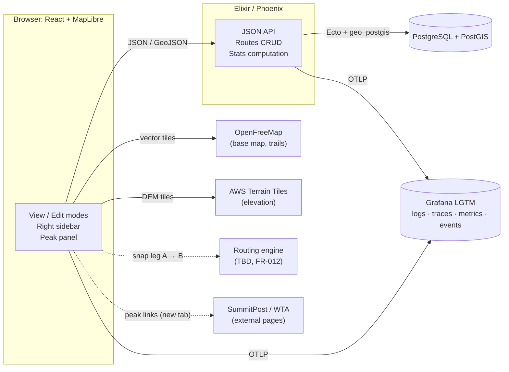

# Feature Specification: Steer (Hiking Route Builder)

**Created**: 2026-09-24
**Status**: Draft
**Scope**: High-level architecture and MVP. Detailed behavior of individual features will be covered in separate feature specs.
**Format**: Based on [GitHub Spec Kit `spec-template.md`](https://github.com/github/spec-kit/blob/main/templates/spec-template.md), with a Technical Context section adapted from its `plan-template.md`.

**Input**: A web app for building and saving hiking routes. **View mode** shows a topographic map with contours and hillshade, and draws whichever saved route is selected in the sidebar. **Edit mode** lets the user build a route by clicking points on the map. Each leg snaps to the most efficient path along existing trails (preferred) or roads. The user can then save and exit easily. Clicking a peak on the map shows its details, and for Washington peaks, links to SummitPost and WTA.

---

## 1. User Scenarios & Testing

### User Story 1 - View the topographic map (Priority: P1)

The user opens the app and sees a map with topographic contour lines, hillshade and trails, which are always on. No route is drawn until the user selects one in the sidebar (User Story 4).

**Why this priority**: This is the base experience everything else sits on. Most of it already exists in the prototype.

**Independent Test**: Load the app. Contours, hillshade and trails are visible, and no route is drawn.

**Acceptance Scenarios**:
1. **Given** the app has just loaded, **When** the map renders, **Then** contours, hillshade and trails are visible and no route is drawn.

---

### User Story 2 - Create a route by clicking points (Priority: P1)

From the initial screen, the user clicks **Create route** to enter edit mode. They click point A, then point B, and the leg between them snaps to the most efficient path, always preferring trails. They keep clicking (C, D, …) to extend the route. They can **Undo**, **Redo**, **Clear** the whole route, or **Close loop** back to the start.

**Why this priority**: Building routes is the core value of the app.

**Independent Test**: Enter edit mode, click several points in an area with known trails, and check that the drawn line follows those trails. Use undo, redo, clear, and close loop, and check that each one gives the expected route.

**Acceptance Scenarios**:
1. **Given** edit mode with one point placed, **When** the user clicks a second point, **Then** a leg snapped to trails or roads appears between them within 1 second.
2. **Given** a route with several points, **When** the user clicks Undo, **Then** the last point and its leg are removed. Redo restores them.
3. **Given** a route with several points, **When** the user clicks Close loop, **Then** a snapped leg from the last point back to the first is added.
4. **Given** a route in progress, **When** the user clicks Clear, **Then** all points and legs are removed.
5. **Given** a leg where no trail or road connects the points, **When** the leg is computed, **Then** it falls back to a straight cross-country line automatically.

---

### User Story 3 - Save and exit edit mode (Priority: P1)

The user saves the route. Entering a name is optional; if they skip it, a name is generated. They then return to view mode. If they try to leave with unsaved changes, they are warned.

**Why this priority**: Routes have to persist, or building them has no value.

**Independent Test**: Build a route, save it without a name, reload the app, and check that the route appears with a generated name.

**Acceptance Scenarios**:
1. **Given** a route in progress, **When** the user saves without entering a name, **Then** the route is stored with an auto-generated name and the app returns to view mode.
2. **Given** unsaved changes, **When** the user tries to leave edit mode, **Then** they are warned before the changes are lost.

---

### User Story 4 - Browse saved routes in the sidebar (Priority: P1)

A sidebar on the right lists saved routes. Clicking a route draws it on the map (the only route drawn) and fits the map to it, and the sidebar shows its distance, elevation, and elevation gain and loss.

**Why this priority**: This is how the user finds and reviews their routes.

**Independent Test**: With two or more saved routes, click each one in the sidebar. The map fits the selected route and the stats match it.

**Acceptance Scenarios**:
1. **Given** saved routes exist, **When** the user clicks one in the sidebar, **Then** only that route is drawn, the map fits it, and the sidebar shows its distance (mi), elevation (ft), and gain/loss (ft).
2. **Given** a route is selected, **When** the user clicks a different route, **Then** the first route disappears and the new one is drawn.

---

### User Story 5 - Edit or delete an existing route (Priority: P2)

From a selected route in the sidebar, the user clicks **Edit** to open it in edit mode with the same tools as creating a route, or **Delete** to remove it.

**Why this priority**: Important for keeping routes useful over time, but not needed to prove the core loop.

**Independent Test**: Edit a saved route, extend it, save it, and check the change. Delete a route and check that it is gone from both the map and the sidebar.

**Acceptance Scenarios**:
1. **Given** a selected route, **When** the user clicks Edit, **Then** edit mode opens with that route's points and legs loaded.
2. **Given** a selected route, **When** the user deletes it, **Then** it is removed from storage, the map, and the sidebar.

---

### User Story 6 - Look up a peak (Priority: P3)

In view mode, the user clicks a named peak on the map. The sidebar shows the peak's name and elevation. For peaks in Washington State, it also links to the peak's SummitPost page and to related hikes on WTA.

**Why this priority**: Useful for planning a trip, but not part of building routes.

**Independent Test**: Click Kendall Peak. The sidebar shows its details, and each link opens the right page in a new tab.

**Acceptance Scenarios**:
1. **Given** view mode, **When** the user clicks a named peak in Washington State, **Then** the sidebar shows its name, elevation (ft) and links to SummitPost and WTA.
2. **Given** a Washington peak with no curated links, **When** it is selected, **Then** the links are search links for that peak name.
3. **Given** a peak outside Washington, **When** it is selected, **Then** the sidebar shows its name and elevation with no links, and a note that links cover Washington peaks only.
4. **Given** a route is selected and drawn, **When** the user clicks a peak, **Then** the sidebar shows the peak and the route stays drawn on the map.

---

### Edge Cases

- A click lands far from any trail or road: the leg falls back to a straight line (details deferred to a feature spec).
- The routing service is slow or unavailable: the user must not lose route progress.
- Routes can be in any region of the world, including the antimeridian and polar areas where map projections distort.
- A saved route has no name: the generated name must be unique enough to tell routes apart in the sidebar.
- Two peaks share a name (e.g. Mount Defiance near Snoqualmie Pass and Mount Defiance in Oregon): curated links must only attach to the right one, so they are matched by location as well as name.
- A peak has no elevation in the map data: the sidebar shows "Elevation unknown" and still shows its links.
- A peak without a name is not clickable, since there is nothing to link to.
- A peak near the Washington border: whether it gets links depends on the state outline, not a rough bounding box.
- In edit mode, clicking a peak adds a waypoint like any other map click. It does not select the peak.
- A route is selected and the user clicks a peak: the route stays drawn on the map while the sidebar shows the peak. Closing the peak brings back the route's stats.

---

## 2. Requirements

### Functional Requirements

- **FR-001**: The system MUST display a map with topography (contours), hillshade and trails, always on (not toggleable in the MVP). Only the route selected in the sidebar is drawn.
- **FR-002**: The system MUST have a view mode and an edit mode. Users MUST be able to enter edit mode to create a new route or to edit an existing one.
- **FR-003**: In edit mode, users MUST be able to add points by clicking the map. Each leg between consecutive points MUST snap to the most efficient path, preferring trails over roads.
- **FR-004**: When no trail or road path exists between two points, the system MUST fall back to a straight line automatically, without the user doing anything.
- **FR-005**: Users MUST be able to undo, redo, clear the whole route, and close the loop back to the first point. Individual points cannot be deleted directly; undo covers that.
- **FR-006**: Users MUST be able to save a route. Naming it MUST be optional, and unnamed routes MUST get a generated name.
- **FR-007**: The system MUST warn users before they leave edit mode with unsaved changes.
- **FR-008**: The system MUST show saved routes in a right-hand sidebar. Selecting a route MUST fit the map to it and show its distance, elevation, and elevation gain and loss.
- **FR-009**: Users MUST be able to delete saved routes.
- **FR-010**: All measurements MUST be shown in imperial units (miles, feet).
- **FR-011**: The system MUST support routes anywhere in the world.
- **FR-012**: The routing/snapping engine is [NEEDS CLARIFICATION: hosted routing API (e.g. GraphHopper, Valhalla, BRouter) vs. a self-hosted engine (e.g. BRouter, GraphHopper, Valhalla, OSRM, or pgRouting inside Postgres). Must support a hiking profile that prefers trails.]
- **FR-013**: In view mode, users MUST be able to click a named peak to see its name and elevation. For peaks in Washington State, the system MUST also show links to SummitPost and WTA. The links go to exact pages where a curated link exists, and to site searches otherwise. AllTrails is out of scope because it has no API and forbids scraping.
- **FR-014**: The system MUST emit telemetry from the start of development: structured logs, distributed traces (browser → API → database and routing engine), metrics, product events for key user actions, and frontend errors. All of it MUST be queryable in one place. Each measurable success criterion MUST have a metric so it can be checked from real use. Telemetry MUST NOT include personal data or route coordinates, and failures in telemetry MUST NOT affect the app.

### Key Entities

- **User**: The owner of routes. The MVP has exactly one implicit user and no login, but every route carries an owner reference so accounts can be added later without migrating data.
- **Route**: Name (optional or generated), owner, ordered waypoints, the resolved snapped geometry (a line with elevation), computed stats (distance, min/max elevation, gain, loss), and timestamps.
- **Waypoint**: One user-clicked point (longitude, latitude) in a route's ordered list. The waypoints are kept so a route can be re-snapped and edited.
- **Peak**: A named summit from the base map's data: name, location, elevation (when known) and rank (how prominent it is on the map). Peaks are read from the map tiles and are not stored by Steer.
- **Peak Link**: A link from a Washington peak to its SummitPost page or to WTA hikes. It is either an exact page from a small curated list, or a search for the peak's name on that site.
- **User Settings** *(future)*: Saved preferences such as default layer visibility.

---

## 3. Success Criteria

### Measurable Outcomes

- **SC-001**: After the user clicks a new point, the snapped leg appears in under 1 second.
- **SC-002**: The user can create, name, and save a multi-point route in under 2 minutes without instructions.
- **SC-003**: Selecting a route in the sidebar draws it and fits the map with no visible delay.
- **SC-004**: A saved route reloads with identical geometry and stats after a page refresh.
- **SC-005**: For any route that has at least one trail option, the snapped path follows trails and uses roads only where no trail connects.
- **SC-006**: Clicking a peak shows its details in the sidebar with no visible delay, and every curated link opens the correct page.

---

## 4. Assumptions

- **Single user for the MVP**: no authentication. The data model and API are designed so multi-user accounts can be added later.
- **Desktop browser first**: the layout should not rule out phones and tablets, which are planned for later.
- **Map data**: base map tiles come from OpenFreeMap (OSM-based vector tiles, no API key). Elevation comes from AWS Terrain Tiles (Terrarium encoding), which also feed hillshade, contours, and route elevation stats.
- **Main use is hiking**: routing always prefers trails.
- The map opens on a fixed default view of the Snoqualmie Pass area, covering Web Mountain, Mount Defiance, Bandera and Little Bandera Mountains, Kaleetan Peak, Snoqualmie Mountain, Guye Peak and Kendall Peak.
- Hosting and deployment are not decided yet.
- **Peak data**: peak names, locations and elevations come from the `mountain_peak` layer already in the OpenFreeMap tiles. No extra data source is needed.
- **Washington outline**: peak links are limited to a simplified Washington State outline made from public-domain US Census boundary files.
- **Peak links are only links**: Steer doesn't copy, cache or scrape content from SummitPost or WTA.

### Out of Scope (MVP)

- Detailed rules for cross-country fallback (distance thresholds, styling straight legs differently)
- Elevation profile chart and live stats while editing
- Dragging or directly deleting individual waypoints
- GPX import and export
- Layer toggles for topography and hillshade, and showing all saved routes at once
- Saved user settings (e.g. remembered layer toggles)
- User accounts and multi-user support
- Mobile and tablet layouts
- Snapping to terrain features such as ridgelines (stretch idea: find ridges from the elevation data)
- AllTrails links (there is no API, and its terms forbid scraping)
- Peak links outside Washington State
- Exact links for every Washington peak. Bulk-importing SummitPost IDs from Wikidata is a follow-up, depending on how many peaks Wikidata covers.
- Searching for peaks by name

---

## 5. Technical Context

| Area | Choice |
|---|---|
| **Frontend** | TypeScript, React 19, Vite |
| **Map rendering** | MapLibre GL via `react-map-gl`, contours via `maplibre-contour` |
| **Backend** | Elixir, Phoenix (JSON API) |
| **Database** | PostgreSQL + PostGIS, accessed through Ecto with `geo_postgis` |
| **Routing engine** | Open. See FR-012 |
| **Telemetry** | OpenTelemetry (browser SDK and Erlang/Elixir SDK), sending to Grafana LGTM (Loki, Tempo, Prometheus, Grafana) in Docker for development |
| **CI** | GitHub Actions running oxlint on PRs and pushes to `main` |
| **Hosting** | To be decided |

### Architecture Overview

> Whether the client calls the routing engine directly or goes through the Phoenix API depends on the engine choice (FR-012).

### Technical Notes

- **Storage**: each route stores its ordered waypoints (for editing and re-snapping) and its resolved geometry as a PostGIS `LineStringZ` (for display and stats). The API returns GeoJSON that MapLibre can use directly.
- **Stats**: distance is computed with PostGIS geography functions (`ST_Length`). Elevation gain and loss come from the Z values sampled from the DEM along the resolved line.
- **Undo/redo** is client-side state in edit mode. Only the saved route is sent to the backend.
- **Performance**: SC-001's sub-second target means per-leg routing requests must be fast. This limits the routing engine choice (FR-012).
- **Peaks** are entirely client-side. A MapLibre layer draws the tiles' `mountain_peak` features and handles clicks. Links are built in the browser, from the curated list or from each site's search URL. The Washington check is a point-in-polygon test against the bundled state outline. The peak feature doesn't use the backend.
